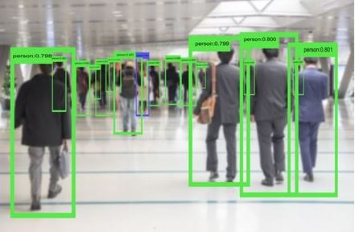
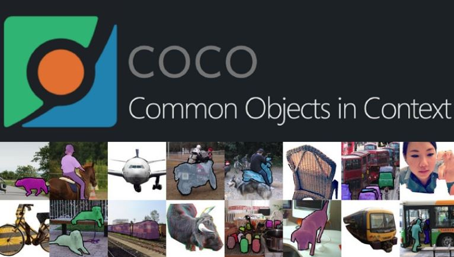
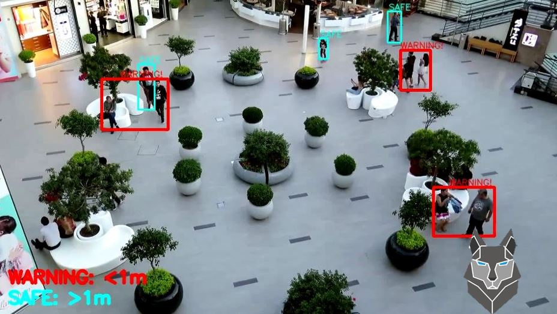
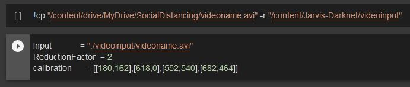
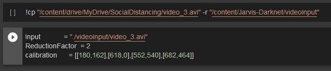

# Social-Distancing-Jarvis
Jarvis Team repository of Social Distancing Project 

Paper:

## Guideline to Run Training Model:

The training code is in'oficialjarvis_yolov4_training.ipynb' Google Colab Notebook

1. Get GPU
2. Clone and compile Darknet
3. Get a pre trained neural network
4. Customize a new dataset for a new over training
5. Train Yolov4
6. Test training in new image

Anyway, a detailed steps to run the code are in the Google Colab 'oficialjarvis_yolov4_training.ipynb' file

## Guideline to Run our COCO dataset

The COCO dataset code is in the 'JARVIS_oficial_COCO_Dataset.ipynb' Google Colab Notebook 

1. Download train/validation/test dataset from COCO
2. Unzip all folders
3. Choose the class you want to download
4. Zip all the class images
5. Download it!

Anyway, a detailed steps to run the code are in the Google Colab 'JARVIS_oficial_COCO_Dataset.ipynb' file

## Social Distancing Detection Online Execution on Colab

## Guideline to Run the Code:
____________________________________
### Execution on Google Colab

The code can be executed in Google Colab by following the guideline below:
1. Click on the 'SocialDistancingJarvis.ipynb' and open it in Colab and make a copy in your account
2. Download all the files located in 'SocialDistance' folder:
3. Create a folder named **SocialDistance** in the root of your Google Drive, and upload all the files previously downloaded.
4. Click on "Run all" under the Runtime menu or use the Ctrl+F9 shortcut.
5. At the begining of the execution the code requires to access the required files by mounting your Google Drive. Click on the provided link, copy the generated code by Google, and paste it in the next line within the given box.
6. The program would keep running showing a detection progress bar untill reaching 100% and ends by generating 2 output video files in **Jarvis-Darknet/videooutput** folder, as follows:
    * /content/Jarvis-Darknet/videooutput/Detection.avi
    * /content/Jarvis-Darknet/videooutput/CrowdMap.avi

Note: For change the video input, change 'videoname.avi' for another video name located in the Google Drive folder, for example:

With the name change:

